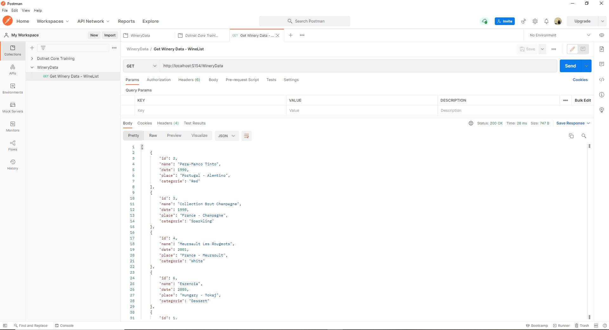
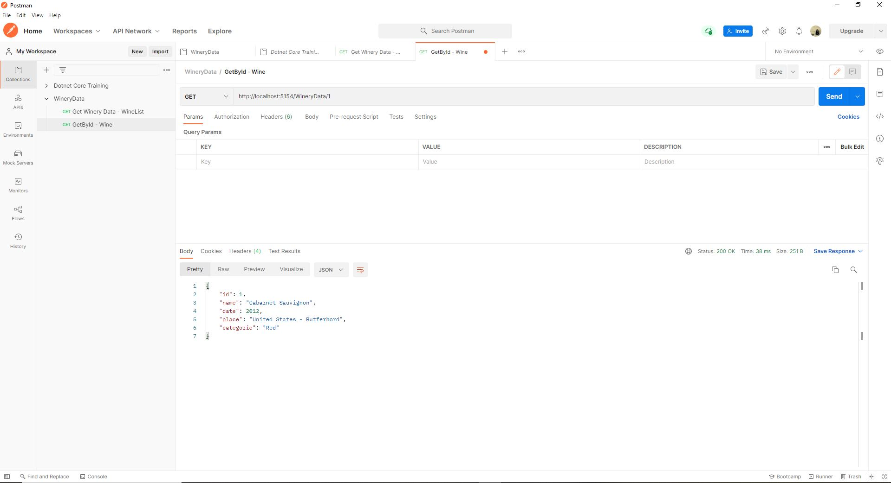
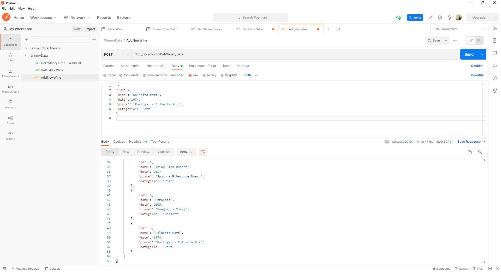
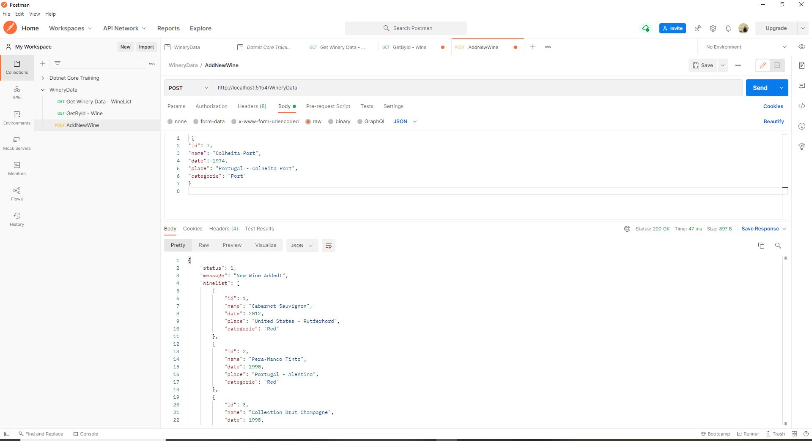
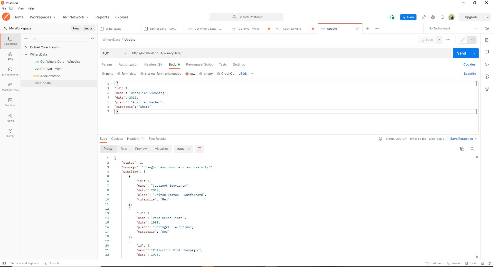
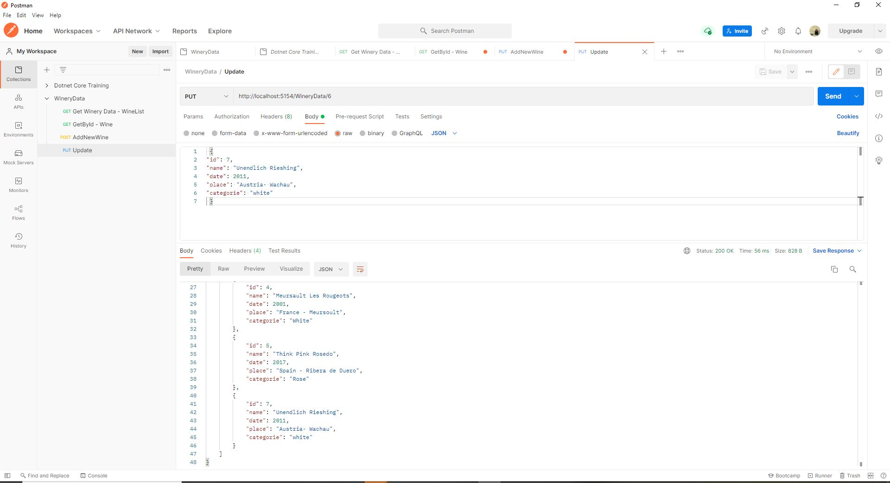
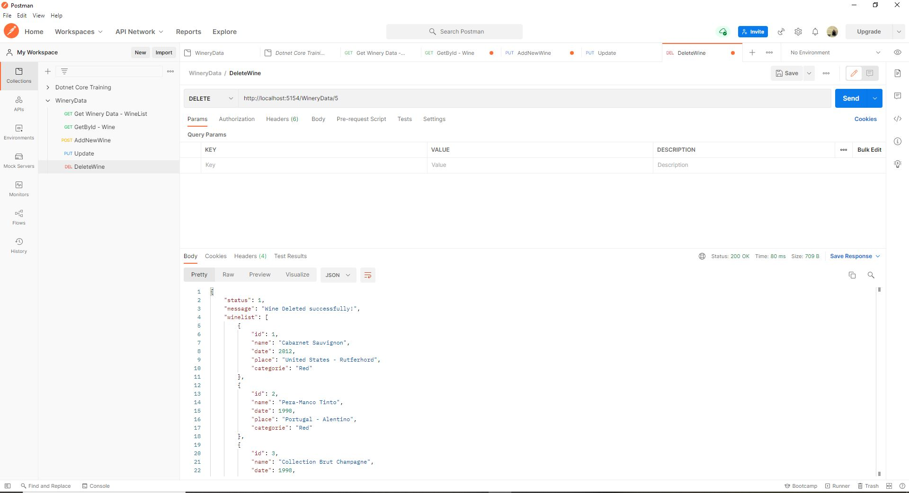
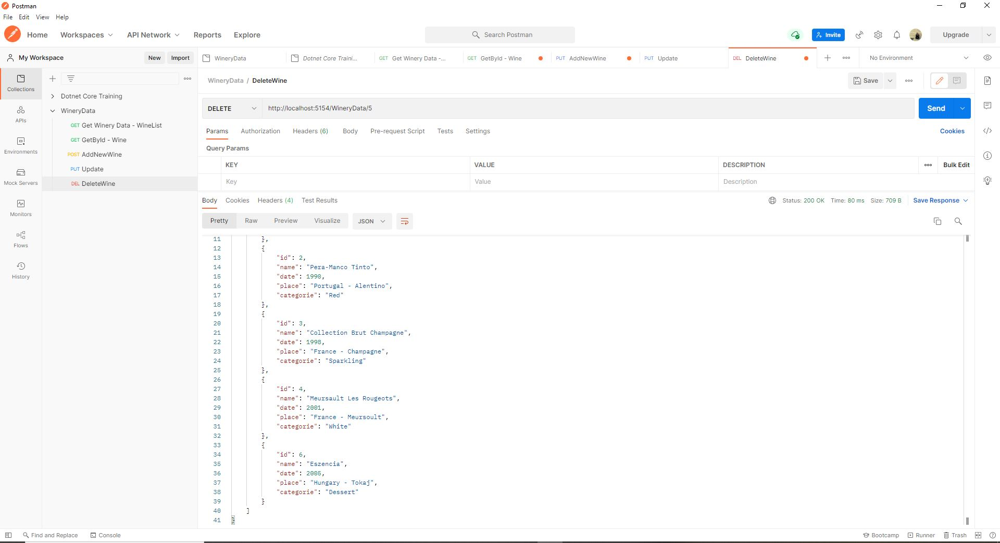

##Postman Usage

####Using Postman to test API
- **GET** - Get all wines 
- **GET** - Get wine By Id
- **POST** - Create new wine
- **PUT** - Update wine in the  winelist
- **DELETE** - Delete wine from winelist

### GET - Get all wines 

### GET - Get Wine By Id

### POST - Create new wine

-------------------------------------

### PUT - Update wine in the winelist

-------------------------------------

### DELETE - Delete wine from winelist

-------------------------------------
