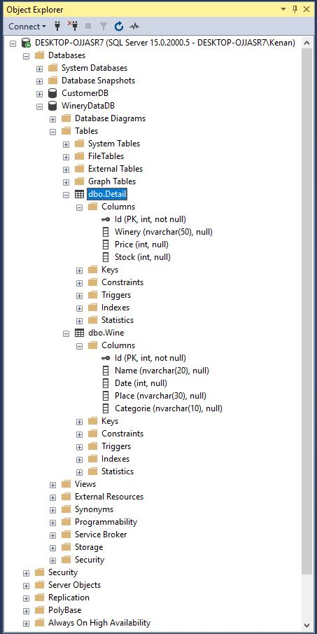
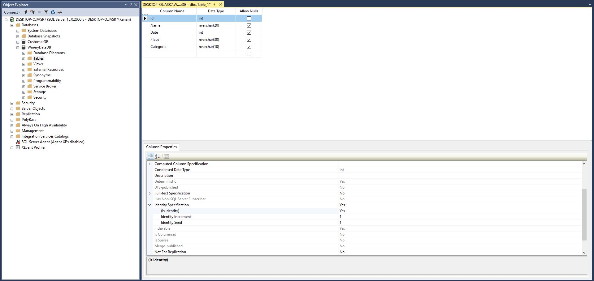
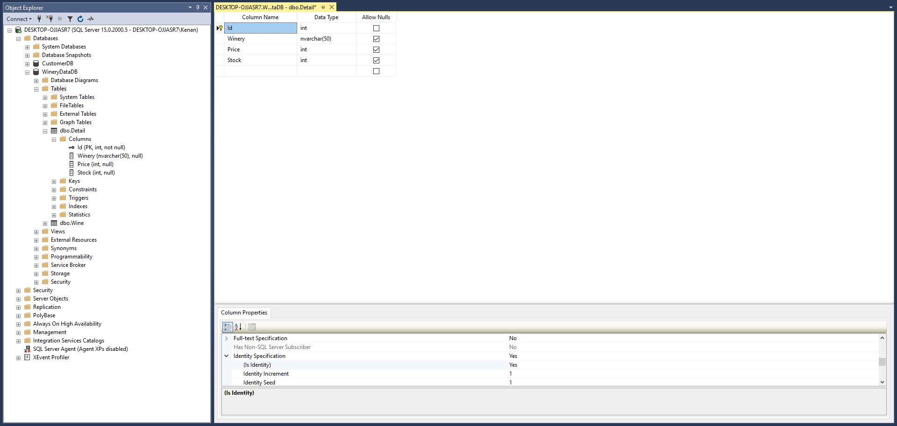
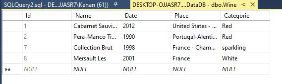
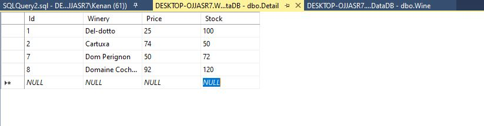
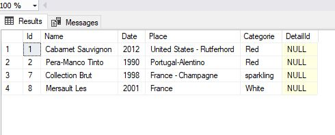
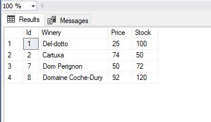
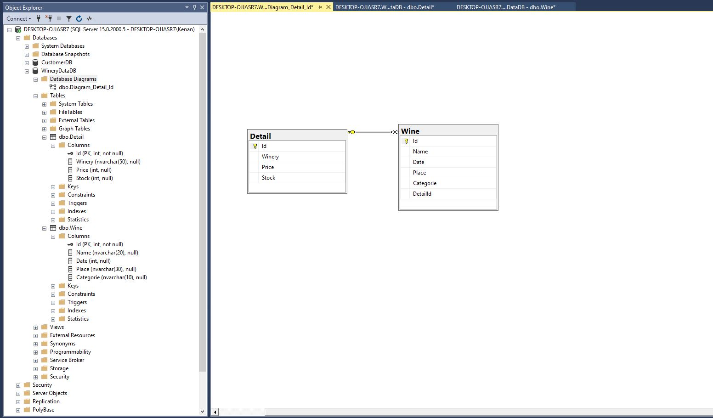

## SQL Database

#### Create Sql Database and Tables
- Create Database 
- Create Two Table (Wine and Detail)
- Connect to two table (Wine and Detail)

### Create Database 

### Create Two Table (Wine and Detail)
##### Create Wine Table 

##### Create Detail Table 

##### Added Wine 

##### Added Wine Details

##### Wine List

##### Wine Details List

### Connect to two table (Wine and Detail)

