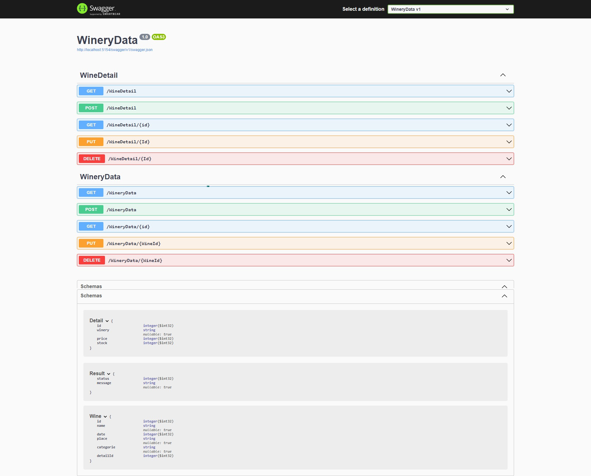
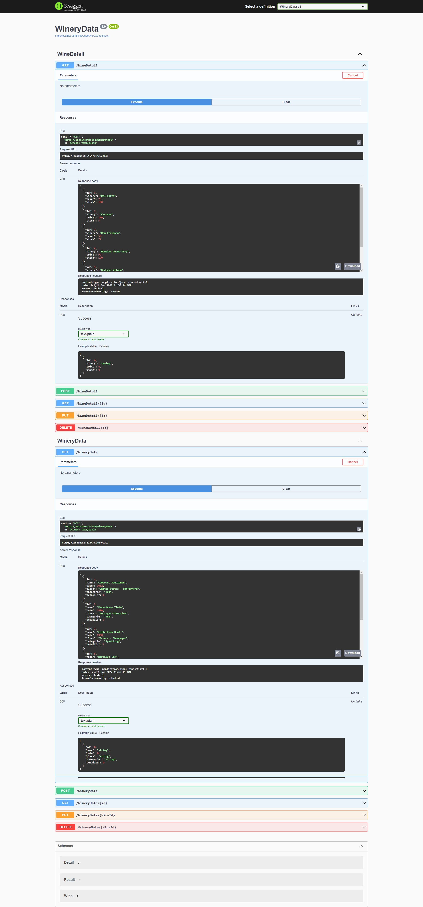

## Week 4 Homework
#### - Connect SQL Database With API 
#### - Add Entity FrameWork Core  

- Created WineContext class
- Created DbSet for each entity
- Created DBOperations and DBDetailOperations classes
- Connected DBOperations and DBDetailOperations classes with WineContext class
- Update all methods to use DBOperations and DBDetailOperations classes

##### HTTP request methods in Swagger UI for two lists;

##### Get all Wines and Details

